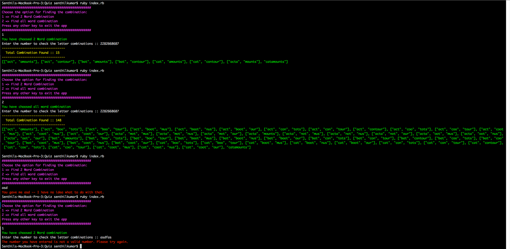
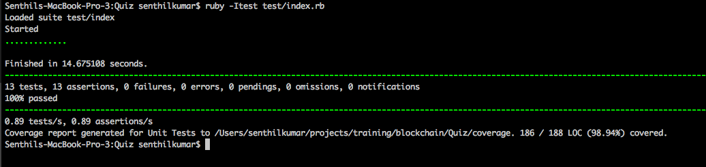

# Number to word
 
> 

## About

The project is a Ruby script which takes an input of a 10 digit phone number and converts into meaningful words by performing keypad's letter combinations against a dictionary file


## Algorithm / Walkthrough

1. Given a 10 digit phone number as input
2. Based on the input digit it returns the list of all possible combinations of words (minimum 3 letters per word) from the dictionary file.
3. The resulted combination values is mapped directly in order to form the phone number.
4. Then number to letter mapping is as follows :

    | Digit    | TYPEPAD    |
    |:---------|:-----------|
    | 2        | A,B,C      |
    | 3        | D,E,F      |
    | 4        | G,H,I      |
    | 5        | J,K,L      |
    | 6        | M,N,O      |
    | 7        | P,Q,R,S    |
    | 8        | T,U,V      |
    | 9        | W,X,Y,Z    |

## Getting Started

Getting up and running is as easy as 1, 2, 3.

1. Make sure you have [Ruby](https://www.ruby-lang.org/en/) installed.
2. Navigate the path,

    ```
    cd path/to/ruby-number-2-word
    ```

3. Start your app

    ```
    ruby index.rb
    ```

### Benchmark

`ruby benchmark.rb`

```
==========================================
Single Bench mark report for Number2word::
==========================================
                user     system      total        real
Number2word  0.110000   0.010000   0.120000   (0.116221)

==========================================
Bench mark report for Number2word:: (100)
==========================================
                user     system      total        real
Number2word  35.350000   0.860000  36.210000  (36.294069)
```

### Testing

Simply run `ruby -Itest test/index.rb` and all your tests in the `test/` directory will be run.

##### Single Test

Run `ruby -Itest test/main_test.rb` in the `test/` will be run.

##### DOCKER

Run `docker-compose run app ruby index.rb` for running the application using docker instance.

## Output screen

#### Program Output


#### Test Output


## Changelog

__1.0.0__

- Initial release

## License

Copyright (c) 2019

Licensed under the [MIT license](LICENSE).

## Author

Senthil Kumar Bhaskaran